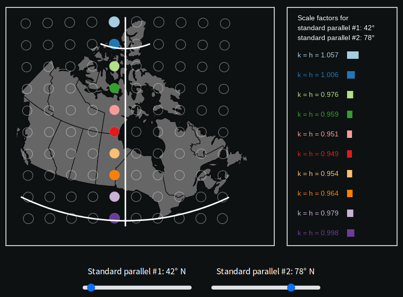

Map Distortions for the Statistics Canada Lambert Projection (EPSG:3347)
===================
The *Statistics Canada Lambert* (EPSG:3347) is a Lambert Conformal Conic map projection adopted by Statistics Canada. The code in this repository attempts to show the map distortions when selecting different values for the two standard parallels. The distortions are quantified by showing the Tissot's Indicatrices at regular intervals. Because the distortions are rather difficult to asses on the map, a table showing the h and k scales values (and a dynamic bar) are displayed to the right of the map.

Release History
---------------
* 1.0.0 
	* First working release

Screenshot
---------------

Licence
---------------------------
The **Map Distortions for the Statistics Canada Lambert Projection (EPSG:3347)** app is available under the [GNU General Public License](https://www.gnu.org/licenses/gpl-3.0.en.html#license-text)

